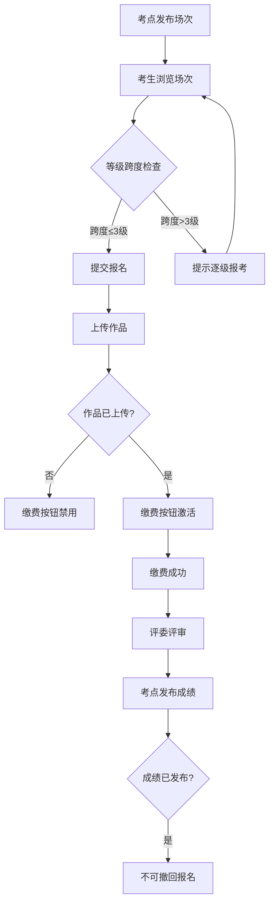

## 1. 产品概述

书法考级报名系统，面向考点、考生和评委三端使用者。考点发布考级场次，考生上传作品并缴费，评委录入成绩；系统严格校验报名限制：作品未上传不可缴费、等级跨度过大提示逐级报考、成绩发布后不可撤回报名。所有数据本地持久化，容器启动即可完整演示。

- 目标用户：书法考级组织机构、书法学习者、评审专家
- 核心价值：线上化考级报名全流程，确保报名合规与流程闭环

## 2. 核心功能

### 2.1 用户角色

| 角色 | 进入方式 | 核心权限 |
|------|----------|----------|
| 考点管理员 | 首页角色切换进入 | 发布/管理考级场次，查看报名与成绩统计 |
| 考生 | 首页角色切换进入 | 浏览场次、报名、上传作品、缴费、查看成绩 |
| 评委 | 首页角色切换进入 | 查看待评审作品、录入/提交成绩 |

### 2.2 功能模块

1. **首页/角色选择页**：水墨风格入口，三角色切换
2. **考点管理页**：场次发布、等级设置、报名统计、成绩发布
3. **考生操作页**：场次浏览、报名提交、作品上传、在线缴费、成绩查询
4. **评委评审页**：待评审列表、作品查看、成绩录入、提交确认

### 2.3 页面详情

| 页面名称 | 模块名称 | 功能描述 |
|----------|----------|----------|
| 首页 | 角色选择 | 三角色卡片入口，水墨动画背景 |
| 考点管理 | 场次发布 | 新建场次表单：等级选择、时间、名额、费用 |
| 考点管理 | 场次列表 | 已发布场次列表，显示报名人数、状态操作 |
| 考点管理 | 成绩发布 | 查看评委已录入成绩，一键发布，发布后锁定 |
| 考生操作 | 场次浏览 | 可报名场次卡片列表，等级/时间筛选 |
| 考生操作 | 报名与作品 | 填写报名信息、上传作品图片（必须上传才能缴费） |
| 考生操作 | 缴费确认 | 作品已上传后显示缴费按钮，模拟支付完成 |
| 考生操作 | 我的报名 | 已报名记录，状态追踪，成绩查看 |
| 评委评审 | 待评审列表 | 按场次筛选待评审考生列表 |
| 评委评审 | 成绩录入 | 查看作品大图，录入分数与评语，提交 |

## 3. 核心流程

### 3.1 报名限制流程

考生报名时，系统按以下顺序校验：
1. 选择场次与等级 → 检查等级跨度（超过3级提示逐级报考）
2. 提交报名 → 进入"待上传作品"状态
3. 上传作品 → 状态变为"待缴费"，缴费按钮激活
4. 缴费成功 → 状态变为"已缴费"，等待评审
5. 评委录入成绩 → 考点发布成绩 → 状态变为"已完成"
6. 成绩发布后 → 不可撤回报名

### 3.2 核心流程图

## 4. 用户界面设计

### 4.1 设计风格

- **主题**：新中式水墨风格，融合现代极简
- **主色**：墨黑 (#1a1a2e) + 宣纸白 (#f5f0e8)
- **强调色**：朱砂红 (#c0392b) 用于重要操作和状态
- **辅助色**：黛蓝 (#2c3e50) 用于文字和边框
- **字体**：标题使用楷体风格（Noto Serif SC），正文使用思源黑体（Noto Sans SC）
- **布局**：卡片式布局，圆角8px，微阴影
- **装饰**：水墨晕染纹理背景，毛笔笔触分割线

### 4.2 页面设计概览

| 页面名称 | 模块名称 | UI元素 |
|----------|----------|--------|
| 首页 | 角色选择 | 水墨渐变背景，三张毛笔笔触风格角色卡片，悬停墨晕扩散动画 |
| 考点管理 | 场次发布 | 表单卡片，等级多选标签，时间选择器，发布按钮朱砂红 |
| 考点管理 | 场次列表 | 表格卡片，状态标签（灰/蓝/绿），报名进度条 |
| 考点管理 | 成绩发布 | 统计面板，发布确认弹窗，发布后锁定标识 |
| 考生操作 | 场次浏览 | 等级标签卡片网格，水墨边框装饰 |
| 考生操作 | 报名与作品 | 分步表单，上传区域虚线框+拖拽，等级跨度警告横幅 |
| 考生操作 | 缴费确认 | 缴费卡片，金额高亮，模拟支付按钮 |
| 考生操作 | 我的报名 | 状态时间轴，作品缩略图，成绩详情折叠面板 |
| 评委评审 | 待评审列表 | 卡片列表，考生信息+作品缩略图 |
| 评委评审 | 成绩录入 | 左右分栏：左侧作品大图，右侧评分表单 |

### 4.3 响应式设计

- 桌面优先设计，最小宽度1024px
- 平板适配：768-1024px，侧边栏折叠
- 移动端：768px以下，单列布局，底部导航

## 5. 书法等级体系

系统内置书法等级（1-10级，1级最高）：
- 1-3级：初级
- 4-6级：中级
- 7-9级：高级
- 10级：专业级

等级跨度规则：报考等级与已通过等级相差不超过3级，否则提示"建议逐级报考，请先通过X级考试"。
