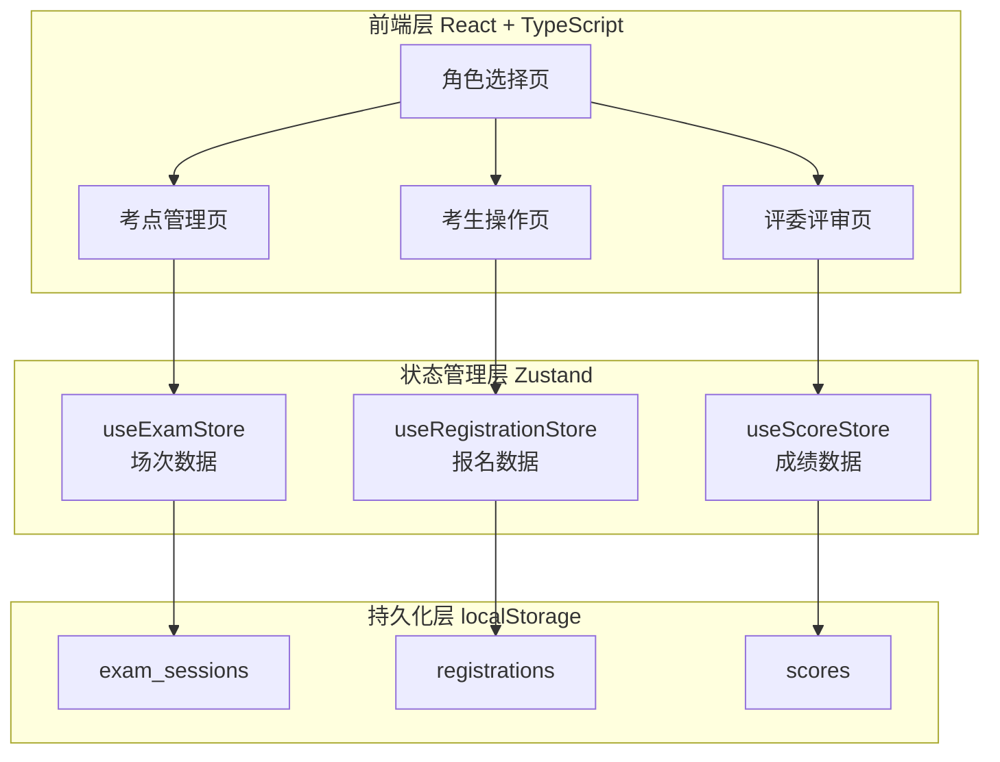
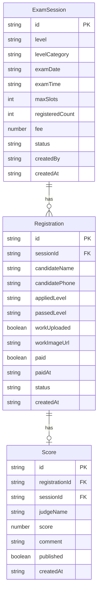

## 1. 架构设计



## 2. 技术说明

- 前端：React@18 + TypeScript + Tailwind CSS@3 + Vite
- 状态管理：Zustand（含persist中间件自动同步localStorage）
- 路由：React Router DOM v6
- 图标：lucide-react
- 数据持久化：localStorage（无需后端，容器启动即用）
- 初始化工具：vite-init (react-ts模板)

## 3. 路由定义

| 路由 | 用途 |
|------|------|
| / | 首页-角色选择 |
| /exam-center | 考点管理主页 |
| /exam-center/create | 发布新场次 |
| /exam-center/scores | 成绩管理与发布 |
| /candidate | 考生-场次浏览 |
| /candidate/register/:sessionId | 报名与上传作品 |
| /candidate/my-registrations | 我的报名记录 |
| /judge | 评委-待评审列表 |
| /judge/score/:registrationId | 成绩录入 |

## 4. 数据模型

### 4.1 数据模型定义



### 4.2 数据定义

#### ExamSession（考试场次）
```typescript
interface ExamSession {
  id: string
  level: number              // 1-10
  levelCategory: '初级' | '中级' | '高级' | '专业级'
  examDate: string           // YYYY-MM-DD
  examTime: string           // HH:mm
  maxSlots: number           // 最大名额
  registeredCount: number    // 已报名人数
  fee: number                // 报名费(元)
  status: 'open' | 'closed' | 'finished'
  createdBy: string
  createdAt: string
}
```

#### Registration（报名记录）
```typescript
interface Registration {
  id: string
  sessionId: string
  candidateName: string
  candidatePhone: string
  appliedLevel: number       // 报考等级
  passedLevel: number        // 已通过等级(0表示无)
  workUploaded: boolean
  workImageBase64: string    // 作品图片Base64
  paid: boolean
  paidAt: string
  status: 'pending_upload' | 'pending_payment' | 'paid' | 'scored' | 'completed'
  canWithdraw: boolean       // 成绩发布后为false
  createdAt: string
}
```

#### Score（成绩）
```typescript
interface Score {
  id: string
  registrationId: string
  sessionId: string
  candidateName: string
  appliedLevel: number
  judgeName: string
  score: number              // 0-100
  result: '优秀' | '良好' | '合格' | '不合格'
  comment: string
  published: boolean
  createdAt: string
}
```

## 5. 业务规则引擎

### 5.1 等级跨度检查
- 规则：appliedLevel - passedLevel > 3 时提示逐级报考
- 已通过等级为0（未参加过考试）时，允许报考1-4级
- 提示信息："建议逐级报考，请先通过{passedLevel + 3}级及以下考试"

### 5.2 缴费前置条件
- 条件：workUploaded === true
- 未上传作品时，缴费按钮显示为禁用状态，附带提示文字"请先上传作品"

### 5.3 撤回限制
- 条件：关联Score.published === true 时，不可撤回
- 撤回按钮在成绩发布后隐藏，状态显示"已完成"

## 6. 预置演示数据

系统启动时自动注入以下演示数据：

**场次数据：**
- 3级书法考试：2026-07-15，名额50，费用200元
- 5级书法考试：2026-07-20，名额30，费用300元
- 8级书法考试：2026-07-25，名额20，费用500元

**考生报名数据：**
- 张三：已通过3级，报考5级（正常跨度），已上传作品，已缴费
- 李四：已通过1级，报考5级（跨度过大），待上传作品
- 王五：已通过6级，报考8级，已上传作品，待缴费
